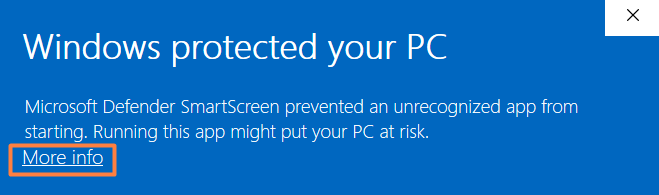

<p align="center">
    <picture>
        <source media="(prefers-color-scheme: dark)">
        
    </picture>
    <br>
    <br>
    <b style="font-size: 16px">© 2022-2025 by AEYCEN / TRAYVED</b>
    <br>
    Better calc than guess.
    <br>
</p>

---

<p style="font-size: 17px">Structure destruction calculator for Ark: Survival Evolved and Ark: Survival Ascended.</p>


## 💪🏼 Features

Some of the features the calculator provides are:

* 💥 **Precise calculation**: Instantly calculates how many explosives or shots are needed to destroy any structure based on its HP, material and weapon type
* 🔢 **Detailed resource cost**: Shows the exact resource cost to craft the required ammo
* ⚙️ **Automatic 6x cave damage option**: Adjusts all damage values when the structure is inside a cave
* 📊 **Supports multiple weapons & materials**: Includes C4, Rocket Launcher, Tek Rifle, Cannon, Grenades and Catapult; calculates for Wood, Stone, Metal and Tek structures
* 🪶 **Lightweight console application**: Runs directly from terminal, fast and minimal
* 🎨 **Colored & formatted output**: Uses ANSI codes for better readability in terminal (bold, colors etc.)
* 🦖 **Customized version for Beginners Next Gen**: Dedicated `-bng` version customized for the most popular ASE Beginner Server


### ❔ Detailed Description

This calculator is used to determine the amount of ammunition and cost of resources required to destroy structures in Ark: Survival Evolved and Ark: Survival Ascended.
The program allows you to enter the type of weapon, the HP and material of the structure and the presence of 6x cave damage.
It then calculates the amount of explosives/ammunition needed and displays the resource cost of crafting the ammo.


## 🛠️ Installation

ArkCulator does not need any installation in order to run. You can execute the .exe file anywhere.

After executing the file the first time you will be prompted by the Windows Defender SmartScreen that the file is unknown to Microsoft and may be harmful.
This is expected and can only be avoided if I, as a developer, pay at least €300 annually for a signing certificate.
As I do not plan to pay for this, you will now have to endure this message and first click on “More info” and then “Run anyway”.



> ℹ️ You are able to verify the source code of the executable inside the C++ file in the `cpp` folder.


<a name="installation"></a>


## 🚀 Usage

The calculator will ask you a total of 4 questions in order to calculate the amount of ammunition you need to destroy a structure.
Always confirm with `ENTER` after an input. After answering a question, your answer will be displayed in front of the next question.

1. What weapon do you want to destroy with?

   `Enter weapon [1(C4)/2(Rocket Launcher)/3(Tek Rifle)/4(Cannon)/5(Grenade)/6(Catapult)]`

    Simply enter the respective number of the weapon (e.g. `3` for the Tek Rifle)


2. What type of Structure you want to destroy?

   `Enter material of structure [wood/stone/metal/tek]`

    You can either write the full word or just the first letter (e.g. `t` for tek)

> ℹ️ If the selected structure type is indestructible by the selected weapon, you will receive a message before you can make any further entries.


3. How many HP has this structure right now?

   `Enter HP of structure`

    A number between 1 and 100'000


4. Is the structure you want to attack in range of the 6x cave damage multiplier?

   `Cave damage? [yes/no]`

    Enter yes, no or just the respective first letter of the word (e.g. `n` for no)


Now you will see how much ammunition you need to destroy the structure with the selected weapon, like for example:

`[Grenade|Wood|10000 HP|No Cave] Grenades needed to destroy: 13`

In addition, you will see what production costs you can expect in order to produce the specified amount of ammunition:
```
Resources needed to craft:
Gunpowder: 390
Fiber: 195
Hide: 65
Metal: 26
Oil: 52
Stone: 260
```

The process then starts all over again. The first question is asked again directly for the next calculation.

You can end the application with the key combination `Ctrl+C` or just by simply closing the window.


## 🪲 Troubleshooting

*There aren't any known issues. Feel free to let me know if you stumble upon any...*


## 🔰 Version

This README file is associated with ArkCulator `v5.2 (11.07.25)`


### ⏫ Upgrading the Version

To upgrade ArkCulator to a newer version, simply download the newer version from the releases tab on GitHub and execute it.
Notice that you will be prompted by the Defender SmartScreen again the first time you run the new version.


### 📑 Changelog

    v5.2    - finished executable release
            - styling improvements
            - added tek rifle element cost calculation
            - added auto-reset after calculation
            - added individual ammo translations

    v5.1    - added input validations
            - bug fixes
            - added bng (Beginners Next Gen) version

    v5.0    - added text coloration and display of user input history
            - user input process simplified

    v4.1    - added branding and description

    v4.0    - code cleanup
            - code efficiency increased

    v3.0    - changed user input process

    v2.0    - added new weapon types: cannon, grenade and catapult 

    v1.0    - initial release as a c++ console application


## 💫 Contact

**Initial development, Conception and Idea**
- TRAYVED (Discord: trayved)

**Further Development, Revamp-Conception & Support**
- [AEYCEN](https://github.com/AEYCEN) (Discord: aeycen)

Create an issue ticket on GitHub for bug reports and feature requests or join our [Discord server](https://discord.gg/N55gSQcVEC) on the `Tech-Support` channel for individual support.


## 📜 License

ArkCulator is licensed under the MIT licence. Please see the [license file](LICENSE) for more information.
[tl;dr](https://www.tldrlegal.com/license/mit-license) you can do whatever you want as long as you include the original copyright and license notice in any copy of the software/source.
Any modifications to ArkCulator must also be made available under the MIT along with install & usage instructions.
